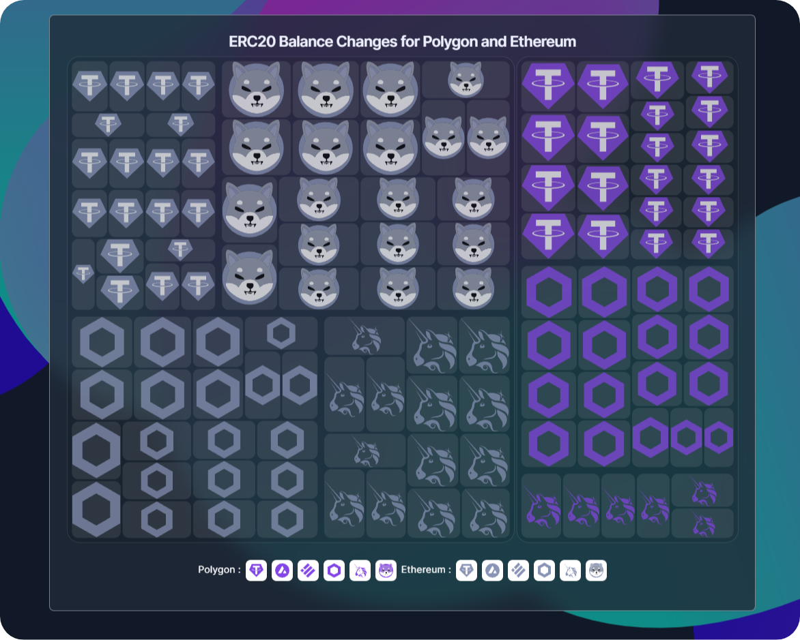

# Substreams Treemap README

## Overview

**Interactive Treemap Visualization:** This project creates a visual map of data using nested figures to show hierarchical relationships of financial data from blockchain contracts and to spot patterns. The size and logo of each rectangle provide insights into the data, like it's contract balances. Clicking a rectangle will let you check the owners transactions on it's respective blockchain scan website

**Real-time Data Integration:** It automatically fetches and updates data from external sources in real-time, ensuring the visualization reflects the most current information about contract metrics.



## Installation and Setup

To get started with Substreams Treemap, follow these comprehensive steps to set up the project environment and run the application:

### 1. Clone the Repository

Clone the repository to your local machine using the following command:

```bash
git clone https://github.com/pinax-network/Substreams-Treemap.git
```

### 2. Navigate to the Project Directory

After cloning, navigate to the project directory with:

```bash
cd Substreams-Treemap
```

### 3. Obtain an API Key

You will need an authentication API token. Obtain an API token at StreamingFast.io or Pinax Network.

- https://app.pinax.network
- https://app.streamingfast.io

### 4. Configure Environment Variables

Configure the necessary environment variables. Create a .env file in the root of the project directory and add the following line, replacing your_api_key_here with the API key you obtained in the previous step:

```env
NEXT_PUBLIC_SUBSTREAMS_API_KEY="your_api_key_here"
```

**This is a crucial step for enabling the application to communicate with the Substreams platform.**

### 5. Install Dependencies

Install the necessary dependencies by executing the following command:

```bash
npm install
```

### 6. Start the Development Server

Start the development server with the command:

```bash
npm run dev
```

This command launches the application on http://localhost:3000 by default. Open this URL in your browser to see the result and interact with the Substreams Treemap visualization.

Follow these steps carefully to ensure that your environment is correctly set up to run the Substreams Treemap application.

## Components Overview

- `page.tsx`: Main entry point for the visualization, handling the layout and integration of the treemap.
- `UnifiedSubstreamsComponent.tsx`: Bridges Substreams data with the visualization, managing data fetching and processing.
- `substreamTreemap.tsx`: Specialized in handling Substreams data, covering rendering logic, state management, and user interactions.
- `treemap.tsx`: Generic component foundational for creating treemaps, adaptable to various hierarchical data visualizations. (D3.js)

## Contributing

We invite the community to contribute, whether through feature requests, code contributions or creating new visualization projects.

**Ideas:**
Integration with D3.js Visualization Tools: Explore the use of various D3.js visualization tools to enhance or provide alternative representations of the data. D3.js offers a vast array of visualization options that could be leveraged to present the data in new and interesting ways. You could also explore other substreams to use in your own project.

https://github.com/substreams-js/substreams-node/tree/main/examples
